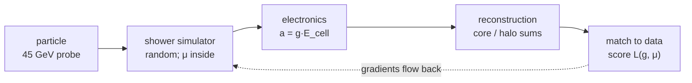
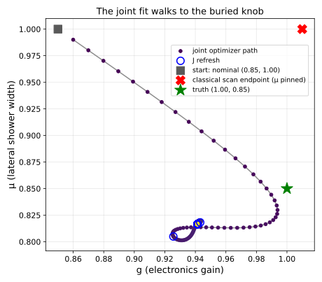
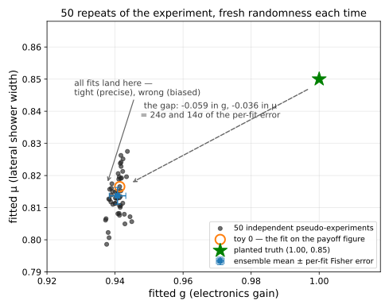

# minlhc — trust, then scale

*A calibration knob we own and a physics knob buried inside a stochastic
simulator, fitted **jointly** — through a measured, frozen response
operator, with every claim guarded by a runnable falsifier.*

This repository is the self-contained case study behind the MODE 6 talk
[**“Trust, then scale: checkable gradients in a minimal end-to-end
pipeline”**](https://indico.cern.ch/event/1655754/contributions/7190201/)
(Sixth MODE Workshop on Differentiable Programming, Kolymbari,
September 2026), companion to *Automatic Differentiation in CMS
Combine: From Integration to Physics-Grade Fits* (J. Rembser,
V. Vassilev, same workshop). The slides live on that Indico page, not
in this repository. One C++ file, no dependencies, ~14 s on a laptop —
and the exit code is the number of failed checks.

## The chain on one screen



Two knobs:

- **g** is ours — the electronics gain, an ADC-per-GeV constant we must
  calibrate. Its gradient path is fully analytic.
- **μ** is nature's — the lateral shower width (the toy's Molière
  radius), fixed by the detector material and buried inside the Monte
  Carlo: no formula connects it to the likelihood, and every run draws
  fresh randomness.

Truth is planted at (g, μ) = (1.00, 0.85). The wrong nominal
(0.85, 1.00) is where the joint fit starts — and where the classical
scan pins μ.

## Two tricks, no differentiable simulator

1. **Same randomness, two runs.** Pin the seed, run the simulator at
   μ+ε and μ−ε with identical draws, subtract: the noise cancels and
   each cell's mean-energy response survives. That table —
   `J[cell] = ∂⟨E_cell⟩/∂μ` — is the **response Jacobian** (1000
   matched-seed pairs, ε = 0.02, 239 non-zero cells here).
2. **Extract once, freeze, splice.** Everything downstream of the
   simulator is plain analytic code; the frozen J enters the chain rule
   as one extra factor — and is refreshed whenever the fit walks
   outside J's **measured validity window**.

Mature fields made the same move decades ago: adjoint wing design,
variational data assimilation, differentiable rendering. The simulator
is treated as a trusted forward oracle; nothing inside it is modified
(see [G4.md](G4.md) for the motivation at experiment scale).

## Run it

```sh
clang++ -std=c++17 -O3 concept/opaque_oracle_demo.cpp -o opaque_oracle_demo
./opaque_oracle_demo                  # ~14 s; prints T1–T6 + the ledger
python3 concept/plot_oracle_demo.py   # regenerates the figures (matplotlib)
```

Abridged from the recorded run
([REPRODUCIBILITY.md](REPRODUCIBILITY.md) has the full output):

```text
  [OK ] T1a FD vs adjoint dL/dg (fully analytic path)         value=9.919e-13     tol=0.0001
  [OK ] T1b FD vs adjoint dL/dμ (through frozen J)           value=0.2016        tol=0.25
  [OK ] T2 Two independent J's agree on L_adj(μ₀+Δμ)     value=0.0036        tol=0.01
  [OK ] T3 Linearity window (where adjoint L(μ) ≈ brute)   value=0.08          tol=0.05
  [OK ] T4 Joint optimizer recovers injected truth            value=0.05863       tol=0.08
  [OK ] T5 Classical 1D scan is biased (|Δg|/g > 1%)         value=0.01          tol=0.01
  [OK ] T6 Mean-level score is unbiased on the truth axes     value=1.11e-16      tol=0.015

  total                                             1964000
  falsifier share (all checks / total): 16.6%

==== 0 failure(s) ================================================
```

## The contract, and what it measured

| check | plain meaning | result |
| :--- | :--- | :--- |
| T1a | gradient math vs. brute force (g path) | 9.9×10⁻¹³ |
| T1b | gradient through the frozen J vs. brute force | 0.20 (tol 0.25); shrinks like 1/√N<sub>seeds</sub> to a dataset floor |
| T2 | two independent J's predict the same L | 0.36 % |
| T3 | where the cheap evaluation tracks the expensive one | μ ∈ [0.96, 1.08] — narrow, so J is refreshed every 50 steps |
| T4 | recover an answer we planted | g = 0.94, μ = 0.82 vs. truth (1.00, 0.85) |
| T5 | the classical fix-μ-and-scan control | best g = 1.01, yet score −8275 vs. the joint fit's −4492 |
| 50 toys | is one successful recovery enough? | **no** — the bias is ≫ the per-fit Fisher error |
| T6 | the fixed (mean-level) score is unbiased | optima exactly at the truth |

The run prints its own **oracle-call ledger** (1.96 M simulator calls
for the full suite; falsifier share 16.6 %), so every efficiency claim
stays all-costs-loaded.

## The payoff — and the catch



The joint fit turns both knobs at once, guided by the cheap gradients
(the simulator is never asked for a derivative), and walks from the
wrong nominal to near the truth. The classical alternative — fix μ at
its nominal, scan g — finds a nearly perfect gain and still fits far
worse, because no gain can compensate for a wrong shower width. It
cannot even ask what μ is: μ is not in its search space.



Then we ran the experiment 50 more times
(`concept/toy_ensemble.cpp`): every toy lands in the same wrong place —
*precise, but biased*. The per-event score compares each event to the
average target, `Σₑ(rₑ−T)² = N[(r̄−T)² + Var r]`, so it rewards being
steady over being right. One good-looking recovery proved nothing; the
framework caught its own showcase. The diagnosis is reproduced with the
optimizer out of the loop in `concept/bias_check.cpp`, and the fix is
banked in the demo as **T6**.

## What transfers

- **The contract, not the code.** T1–T6 as acceptance tests for any
  scaled-up port: dual-path checks against brute force, independence
  checks, measured windows, refresh rules, estimator-level audits.
- **Freeze, then price the freezing.** Every frozen object — a response
  operator, a template, a profiled parameter — ships with its measured
  validity window and its refresh rule.
- **Differentiate interfaces, not implementations.** Template morphing
  is this operator's degenerate case (fixed anchors, no measured
  window, no independence check, no refresh); the approach generalizes
  something analyses already trust.

## Repository map

| path | what it is |
| :--- | :--- |
| `concept/opaque_oracle_demo.cpp` | the demo: pipeline, T1–T6, oracle ledger — single file |
| `concept/plot_oracle_demo.py` | the six demo figures, drawn from the CSVs |
| `concept/toy_ensemble.cpp` | RQ4 harness: 50-toy ensemble + seeds scaling of T1b |
| `concept/bias_check.cpp` | RQ4 harness: objective scans, optimizer out of the loop |
| `concept/plot_toy_ensemble.py` | the ensemble scatter figure |
| `concept/tiny_pipeline.cpp`, `concept/tiny_differentiable_pipeline.cpp` | the earlier teaching pipeline this work grew from |
| `concept/README.md` | the teaching README for that original pipeline |
| `G4.md` | motivation: effective response operators instead of a differentiable Geant4 |
| `abstract-mode6.md` | the talk abstract, claims mapped to evidence |
| `REPRODUCIBILITY.md` | environment, checksums, verbatim output, determinism check |

## Reproducibility

All seeds are fixed: independent runs produce bit-identical CSVs. The
exact environment, source checksums, the verbatim recorded output, and
the determinism check live in [REPRODUCIBILITY.md](REPRODUCIBILITY.md).
The two figures embedded above are tracked as deterministic SVGs so
this page renders; everything else regenerates from the scripts in
about a minute.

License: Apache-2.0.
